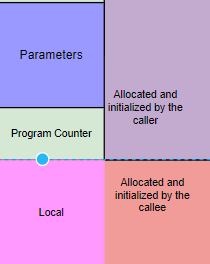

Lecture_10
========================

<h2>Activation Record</h2>
- We will take a look at how a activation record is populated ofr the following funtion

```C
void foo(int bar, int *baz)
{
    char snink[4];
    short* why;
    
    why = (short*)(snink + 2);
    *why = 50;
}
```


- The placement of bar and baz is not arbitrary.
- Parameters are laid down from high to low address, from right to left.
- The variables inside the function appear in memory as they appear in code.
- The space between argument and member variables contains the information where should the code return to after the function call is over.
- By default, the first thing a **C** function does is to make space for its local variables.
- And when a function needs to call another function, the parent function needs to do some stuff which for the child function, which is, build a partial activation function. It has to set aside the space for the parameters.
- Lets see the activation record of **main()** function and what it does when a function **foo()** is called from it.
-  Stack Pointer is a general purpose register which points to the lowest address in the stack that is relavant to the execution.
-  When main is called, the stack pointer is pointing to:


- The allocation of the variable **i** in the main function translates to an assmbly instruction which changes the stack pointer to:
```C 
SP = SP - 4;
M[SP] = 4;  
```


- Now to call the **foo()**, few instructions need to be executed on behalf of **foo()**. which some other function did for the **main()** function. It has to build the partial activation record for the **foo()**. **main()** can tell how many bytes are there in prototype. So the first thing that happens is:
```C
SP = SP - 8;
R1 = M[SP + 8];        // Value of i
R2 = SP + 8;           // Location of i
M[SP] = R1;
M[SP + 4] = R2;
```

- After we setup the parameters, we transfer the control to the **foo()** funtion using **CALL** and once done with the foo instruction, jump back to next instruction:
```C
CALL<foo>;    // Jump to foo function
SP = SP + 8   // Addr of this instruction- will be saved and the code will return to this line once the foo() exits.     
```
- The address that is saved in the block just below the parameters will be of the instruction which would have called if the call to **foo()** wasn't made. It is saved theIr by the **CALL** instruction. As soon as it stops executing, **foo** will have the information in its activation record where it should jump back to. **CALL** instruction on our behalf decrements the SP by 4 and stores the value just below the parameters.


- After **foo()** is called, it does the following:
```C
SP = SP - 8;            // Stack allocation for local variables

R1 = SP + 6;            // get the address snink+2
M[SP] = R1;             // store the value address to why

R1 = M[SP];             // Get the address of the place where 50 needs to be writen            
M[R1] = .2 50;           //Store the value 50

SP = SP + 8;             // Deallocate the stack memory which was used for local variables

RET;                    // Populats the Program counter with the value currently at SP, it would be something like this PC = M[SP] and then SP = SP - 4 
 

```
-  Now in the **main()**, the allocated area for arguments for preparation of the foo call   will be de allocated using ```C SP = SP + 8```.
-  **RV** is a 4 byte value used to communicate return values between the caller and callee function.
-  Now a question arises why the memory is allocated by two separate entities, why is there separation of responsibilities:  


- It is because the caller can put the meaning ful values in the parameters and the caller doesnt know how many local variable there are and how to manipulate them. So that is why local variables are allocated by callee function.
-  Lets see how the following code for calculating factorial is translated into Assembly:
```C
int factorial(int n)
{
    if( n == 0)
         return 1;
    return n * factorial( n - 1 );
}
```
```C
R1 = M[SP + 4];        // Get the value of n
BNE R1,0,PC + 12       // if value of n is not equal to 0 jump to PC + 12, it is 12 because we want to jump to 3rd instruction
RV = 1;
RET;
R1 = M[SP + 4];        // Reloading the value of n
R1 = R1 - 1;
SP = SP - 4;           // Preparing the activation record for function call
M[SP] = R1;
CALL <facorial>
SP = SP + 4;            // Deallocating the stack memory which was declared for parameters
R1 = M[SP + 4];
RV = R1 * RV;
RET;
 
```

- An interesting question during the lecture is how the compiler handles return value greater than 4 bytes. Professor tells that in MIPS, it is handled using two register values(incase of double or long-long) or if it is a structure, the structure is placed somewhere in the memory and then the address is returned and it assumes that caller knows that the structure address is returning and the pointer to structure is later de refrenced.
