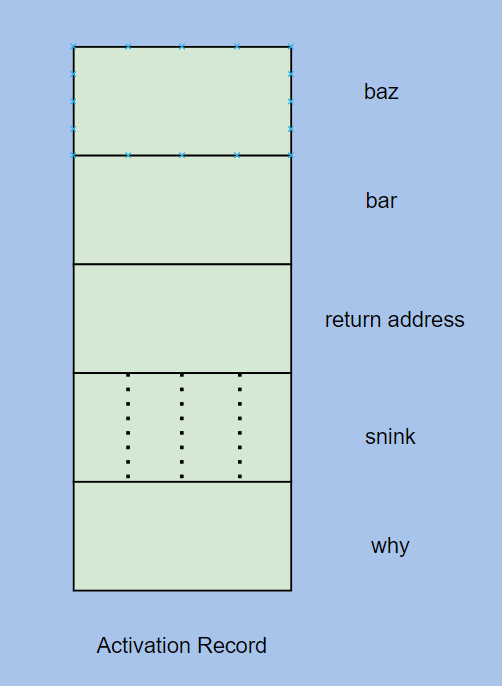

Lecture_10
========================

<h2>Activation Record</h2>
- We will take a look at how a activation record is populated ofr the following funtion

```C
void foo(int bar, int *baz)
{
    char snink[4];
    short* why;
}
```



- The placement of bar and baz is not arbitrary.
- Parameters are laid down from high to low address, from right to left.
- The variables inside the function appear in memory as they appear in code.
- The space between argument and member variables contains the information where should the code return to after the function call is over.
- By default, the first thing a **C** function does is to make space for its local variables.
- And when a function needs to call another function, the parent function needs to do some stuff which for the child function, which is, build a partial activation function. It has to set aside the space for the parameters.
- Lets see the activation record of **main()** function and what it does when a function **foo()** is called from it.
-  Stack Pointer is a general purpose register which points to the lowest address in the stack that is relavant to the execution.
-  When main is called, the stack pointer is pointing to:


- The allocation of the variable **i** in the main function translates to an assmbly instruction which changes the stack pointer to:
```C 
SP = SP - 4;
M[SP] = 4;  
```


- Now to call the **foo()**, few instructions need to be executed on behalf of **foo()**. which some other function did for the **main()** function. It has to build the partial activation record for the **foo()**. **main()** can tell how many bytes are there in prototype. So the first thing that happens is:
```C
SP = SP - 8;
R1 = M[SP + 8];        // Value of i
R2 = SP + 8;           // Location of i
M[SP] = R1;
M[SP + 4] = R2;
```

- After we setup the parameters, we transfer the control to the **foo()** funtion using **CALL** and once done with the foo instruction, jump back to next instruction:
```C
CALL<foo>;    // Jump to foo function
SP = SP + 8   // Addr of this instruction- will be saved and the code will return to this line once the foo() exits.     
```
- The address that is saved in the block just below the parameters will be of the instruction which would have called if the call to **foo()** wasn't made. It is saved theIr by the **CALL** instruction. As soon as it stops executing, **foo** will have the information in its activation record where it should jump back to. **CALL** instruction on our behalf decrements the SP by 4 and stores the value just below the parameters.


- 