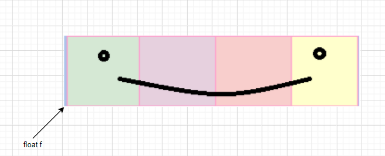

Lecture_2
====================

- Bit is very small unit of memory that can distinguish between two different values.
- Technically a boolean can be mapped to a single bit in memory, but it is not practical do that, but we can engineer our compiler to do that
- A byte can disditingush between 256 values.
- Representation of 2^15 - 1
- Negative number Representation
- Binary Arithmetic is like decimal arithmetic, the only difference is there a lot of carries because there is not enough digits to absorb magnitude
-  Why 1s complement is not used not used commonly? Because it does not follow a simple rule. We want addtion and subtraction to be simple, so for example, if we add -7 to +7, we want 0 as the answer but it is not the case with 1s Complement.
- How the negative number standard was dicided, to make sure the adddition of positive and negative of a same number gets to 0 (2s complement)
- How 1 byte representation is copied to 2 byte representation
- how 2 byte representaion is copied to 1 byte space, only lower bits are adjusted first rather than adjusting all the bits due to lack of space.
- Similar thing will happen if 4 byte integer is copied into 2 byte short type space, it will not become the biggest short type value that is possble like 65535 because we can think that since integer number is larger than short type space, so short space should become all 1 to closely look like the integer value as much as it can. It wont do that, what it will do is is the simple thing which is mentioned in the above example.
- What will happen when a magnitude bit becaomes a signed bit.
- Whamy will happen when a signed bit becomes a magnitude bit
- What is the bit pattern of -1 for interns?
<br>
- Signed bit will extended throughout int space (sign extend)
```C
    short s = -1;
    int i = s;
```

### Floats Representation

Signed Bit 1 bit - Magnitude Only (u_int) 8bits - 23 bits (starts from 2^-1, 2^-2)
		 - exp	                        -.xxxxx
(-1)^signed bit * (1.xxxxx)*2^(exp-127)
xxxxx is limited between 0 and 0.9 bar

|Signed Bit 1 bit | Magnitude Only (u_int) 8bits | 23 bits (starts from 2^-1, 2^-2)|
|-|--------|-|
|-|--------|----------------------- (Bit Space)|


- Representataion of 7 in float standard
- 7.0 * 2^0 (This cannot happen because of the limitation of 1.xxxxx)
- so lets try another representation
- 3.5 * 2^1 (Still we are not in range)
- 1.75 *2^2 (Now we are talking)
- What we have realised is as long as we are adding or subtracting 1 to exp, we can divide and multiply the left part respectively to squash the left part to 1.00 to 1.9999 range
- Just make sure to keep the exp part as whole in limit from **+128** to **-127**.
-  Doubles have more limit than floats

#### Int to Float and Float to Int representation
- `int i = 5;`
<br>
`float f = i;`
- cout **f** will yield 5. it will invent the bit pattern to convert the int 5 to float 5. The above code evaluates 5. <br>
- In another program below, somthing else happens <br>
`int i = 5`
<br>
`float f = * (float*) &i;`
- This code doesnt evaluate 5. It evaluates the memory location where we have 5(location of **i**) . This doesnt cause bits to move around saying we have to be pretend to be something else. All the bits stays there in their postion.

- Another example :  
`float f = 7;`
<br>
`short s = *(short*)&f;`  

- Just for explanation, if **f** has a byte pattern like this
- 

- After copying that bit pattern to **s**, the **s** will look like this  


- Just apoint to note, how the bit pattern is laid in memory is dependent on the architecture, so what exactly will be present in s will be dependent on the architecture you are compiling this code for.


