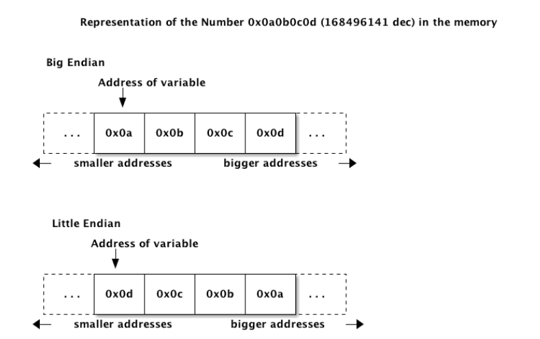
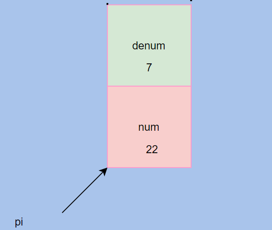
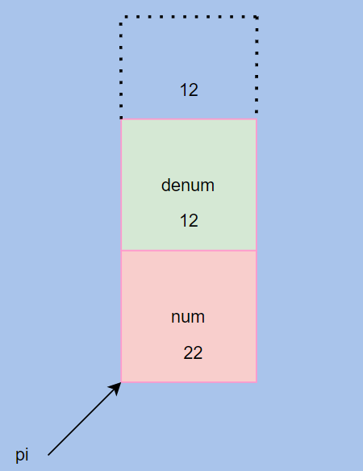

Lecture_3
========================


- Short to double Conversion
```C
short s = 45;
double d = *(double *)&s;
```
- Draw the picture to explain what happens in above scenario

- It will access undeclared regions because double is of 8 bytes.

- As far as the bit copying is concernd, the address to the memory of any structure is always pointing towards the lowest byte.
<h2> Endianess explanation</h2>

- Endianess has more to do with interpretation and placements of bytes relative to one another.

 

- 
<h2>Adressing in Structure</h2>

```C
struct fraction
{
    int num;
    int denum;
};
fraction pi;
pi.num = 22;    // storing the value 22 at the field which is at 0 offset from the base address of the entire struct
pi.denum = 7; // stores 7 at th 4 byte off set, since it knows that denum is right above num which is a 4 byte field


```


- The Address of the whole struct is always co-incident with the first field inside the struct
-  What will happen if we do this

```C
((fraction*)&(pi.denum)-> num = 12;
((fraction*)&(pi.denum)-> denum = 12;

```



<h2>Array Adressing</h2>

- array == &array[0]
- array+k == &array[k] (pointer arithmetic), it knows how much to increment the address
- *(array+k)=array[k] 
- No bound checking in C and C++, in JAVA there is bound checking
- array[-4] is technically correct, it will go back 4 steps from 0 index
- we pass size of the array with arrays in functions to be consistent with the boundaries.
- Activation record is a piece of memory which is declared on the stack for the local variables in the functio, we will discuss this in detail in future lectures.
- If you go out of the bound, by going greater to a greter index, you mess up the local variable defined previously to the array, and if you go out of bound by accessing address lower than what was allocated, then you are messing up the variable that was declared after the array.
- **strdup*** creates dynamically allocated string and returns the address of the string. 
- strdup("Adam") will create 5 bytes of memory with null in the end and return its address. **strdup*** calls **strcpy*** after **malloc**. **strcpy*** continues to copy string until backslash 0 is remaining and it copies that as well.
