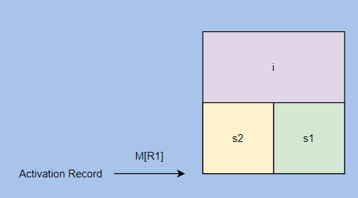
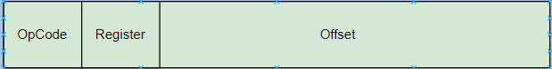

Lecture_9
========================

<h2> Stack Segment </h2>
 
- We will look how the following code will look like in assembly:
 
```C
    int i;
    int j;
    i = 10;
    j = i+7;
    j++;
```


- **R1** stores the base adress of the activation record of the function. 

```C
    M[R1 + 4] = 10; //store operation    
    // M is the base adress of the RAM 
    // Its not actually a register space but it is RAM space
    
    // Since we cannot do addition operation in any place, we have to move the value of i to a register where we can do the addition.
    
    R2 = M[R1+4];     // Load operation           // RAM space to register space
    
    R3 = R2 + 7;          // ALU operation          // Very often, on the right hand side of ALU operation is a single register and an integer, or two registers
    
    M[R1] = R3;       // Store operation for var j
    
    //j++ representation
    R2 = M[R1];
    R2 = R2 + 1;
    M[R1] = R2;
```
- Atomic Type variables: 
> Atomic types are those for which reading and writing are guaranteed to happen in a single instruction.In practice, you can assume that **int** is atomic. You can also assume that **pointer** types are atomic; that is very convenient. Both of these assumptions are true on all of the machines that the GNU C Library supports and on all POSIX systems we know of.

> Hardware is designed to handle 4 bytes in optimized manner, it doesn't mean we cannot handle 2 bytes and 8 bytes, its just that Assembly will need more intructions to handle that.

- Assembly is constructed in context insensitive manner.

```C
    int i;
    short s1;
    short s2;
    i = 200;    --->        M[R1+4] = 200;
    
    // Now lets focus on the following line
    // This line should only update 2 bytes of memory
    s1 = i;
    // We may think the above line will be translated to the folling assembly code.
    M[R1+2] = M[R1+4];
    // This looks correct, but isn't.  
    // The first problem with this is you cannot use load and store type of statements in one go. It would require assembly instruction to encode in 4 bytes. the source memory address and destination memory adress.
    
```



```C
    // We can also write this way  
    R2 = M[R1+4];
    M[R1+2] = R2; 
    // This is syntactically correct, but it will yeild weird results because it is writing 4 bytes in the "short type" memory, so it will go over board and also modify adjacent memory space.  
    // This assembly code has no idea what c/c++ code was in its place to generate this code
```

 
```C
    // We override the 4 byte transfer rule using .2 or .1
    // when .2 or .1 is not there, .4 is used implicitly 
    M[R1+2] = .2 R2;
    // It will just take 2 lower bytes and update the destination
    
    // Now lets looks at the following line:
    s2 = s1+1;
    
    // To move around only 2 bytes using follwoing instruction and sign extention is used inside the rest of the 2 byte register space.
    R2 = .2 M[R1+2]; 

    // It will lay 2 bytes in lower byte space of the register.

    // we add 1 traditionally 
    R3 = R2+1;
    
    // to flush out the result in 2 byte space 
    M[R1] = .2R3;
```


- If there is a loop in a language, you should know that there should be jump clauses that can jump the code back or when the conditional statement is there, the code will jump around based on the condition.
```C
    int array[4];
    int i;
    for( i=0; i<4; i++)
    {
       array[i] = 0; 
    }  
    i--;  
  
    // i = 4
    M[R1] = 0;
    // i < 4
    R2 = M[R1];
    BGE R2, 4, PC + 40     // branch instruction it takes 3 arguments -> first register or ocnst, second regist or const, target address which is the place to jump to if branch condition passes
    // array[i] = 0
    R3 = M[R1];         // for calculating how much jump is required, R3 has a value of i
    R4 = R3 * 4;        // because int has 4 bytes
    R5 = R1 + 4;        // base address of array
    R6 = R4 + R5;       // where the 0 should be written in array
    M[R6] = 0;          // writing 0 to array
    R2 = M[R1];         // for incrementing the value of i
    R2 = R2 + 1;
    M[R1] = R2;
    JMP PC-40
    // i--
    R2 = M[R1];
    R3 = R2 - 1;
    M[R1] = R3;
   
```
- How instructions are encoded in 4 bytes 
> 
> Lets say we have 59 different type of instructions, we would need 6 bits to differentiate 59 instructions, then based on each opcode, we can set aside different bit patterns. according to instruction operation
```C
R1 = M[R2 + 4];            // Load
R1 = 1000;                 // Different type of Load                    
R3 = R6 * R10;             // ALU Opetation
M[R2 - 20] = R19;          // Store                        
```
- Something I read, The ARM processor requires two instructions to store a large value into a register.
- When you put a cast in c code, there is no assembly code instruction that gets generated as a result of cast operation, all the cast does is it allows the copiler to generate code that it wouldn't have been able to generate without it. Its just a permission to behave differently.
